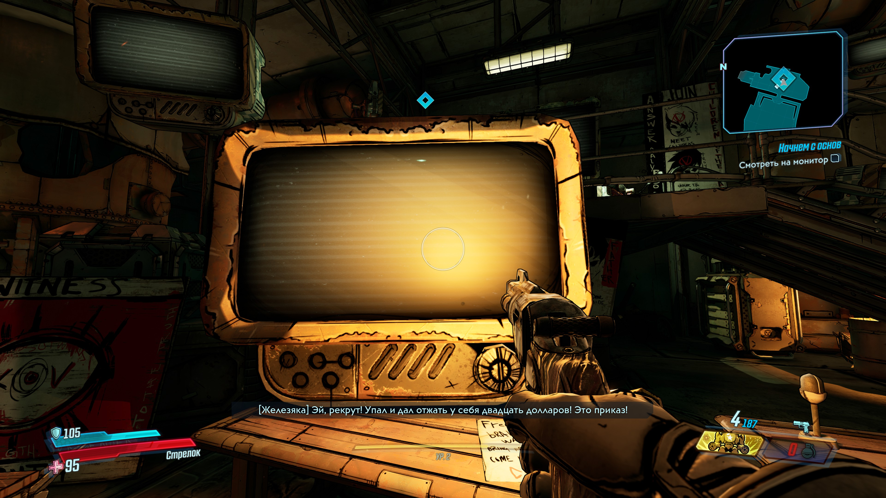
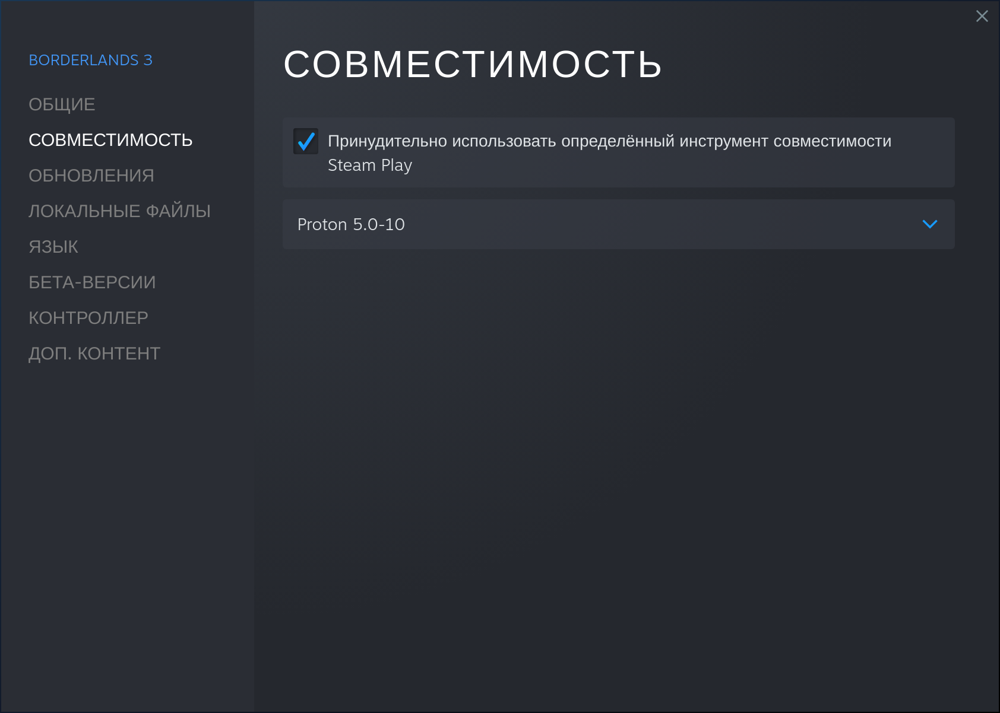
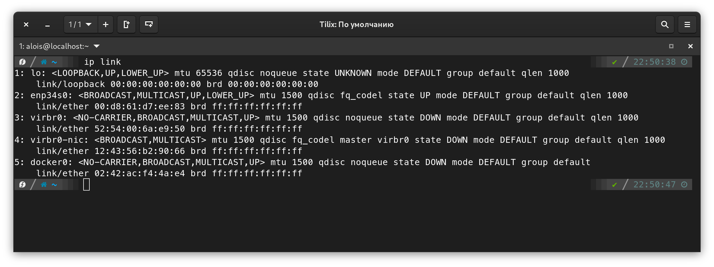

Решил поиграть в третью борду под линуксом и столкнулся с несколькими багами. В этой статье перечислю фиксы этих багов. Будет разобрана *Steam-версия* игры.

> В статье рассматриваются решения баг для Steam-версии игры.

## Исправляем видеоролики в игре

Это фикс исправит все видеовставки в игре:
- лицо Лилит, когда она говорит с нами в первые минуты игры через телепатию
- катсцену, где Лилит включает какое-то видео на телевизоре, после просмотра которого она открывает дверь в новую локацию
- эхонет-ролики главных злодеев в телевизорах на улицах
- и так дале



Причиной бага является отсутствие в системе Media Foundation. Собственно, его нужно установить, чтобы видео в игре работали.

В свойствах игры в Steam задаём версию протона. В интернетах пишут, чтобы мы использовали Proton 5.0-10 в качестве рантайма, но у меня также работает Proton 5.13. Его и заюзаем



Устанавливаем зависимости:

```shell
sudo dnf install cabextract python2
```

Качаем и запускаем скрипт [`mf-install`](https://github.com/z0z0z/mf-install)
```shell
git clone https://github.com/z0z0z/mf-install
cd mf-install
# Здесь в переменной PROTON указываем директорию используемой версии 
WINEPREFIX="$HOME/.steam/steam/steamapps/compatdata/397540/pfx" PROTON="$HOME/.steam/steam/steamapps/common/Proton 5.13" ./mf-install.sh -proton
cd ..
```

Теперь нужно скачать Media Foundation с сайта Microsoft и ещё один скрипт [`mf-installcab`](https://github.com/z0z0z/mf-installcab). Но перед этим нужно сделать симлинк для `libudev`, иначе он не сработает.
```shell
sudo mkdir -p /usr/lib/x86_64-linux-gnu
sudo ln -svf /usr/lib/libudev.so.1 /usr/lib/x86_64-linux-gnu/libudev.so.0
```

После этого можно приступать к скачиванию пакета и его установке.
```shell
# Файл весит примерно 900 МБ
cd mf-installcab
wget http://download.windowsupdate.com/msdownload/update/software/svpk/2011/02/windows6.1-kb976932-x64_74865ef2562006e51d7f9333b4a8d45b7a749dab.exe
mv windows6.1-kb976932-x64_74865ef2562006e51d7f9333b4a8d45b7a749dab.exe windows6.1-KB976932-X64.exe
# Если логи скрипта будут кидать предупреждения о том, что не какого-то файла или каталога - просто проигнорируйте
# В переменной PROTON не забываем указать директорию используемого протона
WINEPREFIX="$HOME/.steam/steam/steamapps/compatdata/397540/pfx" PROTON="$HOME/.steam/steam/steamapps/common/Proton 5.0" ./install-mf-64.sh -proton
cp mfplat.dll "$HOME/.steam/steam/steamapps/common/Borderlands 3/OakGame/Binaries/Win64/"
```

После этого запускаем игру и проверим, что всё работает.

Теперь вступительные ролики и внутриигровые видео нормально работают. Можно и поиграть.

## Online Co-op

[Причина нерабочего коопа](https://www.reddit.com/r/linux_gaming/comments/lem3if/does_borderlands_3_coop_work_on_linux/gmr5aj1?utm_source=share&utm_medium=web2x&context=3) может быть в работающих виртуальных сетях, тонелях и сетях docker/podman.

Убедитесь, что вы отключили VPN.  

Проверим, какие сетевые интерфейсы включены:
```shell
ip link
```


В моём случае присутствуют интерфейсы `virbr0` и `virbr0-nic`. Они создаются `libvirt`'ом и будут созданы заново при необходимости.

Также, если у вас установлен Docker, то он может также создавать свой интерфейс. Чаще всего он называется `docker0`. Docker также создаст его, когда это будет нужно.

Так что эти сети можно спокойно удалять
```shell
sudo ip link delete docker0
sudo ip link delete virbr0
sudo ip link delete virbr0-nic
```

После этого перезапустите игру, если она была уже запущена, и попробуйте войти в игру к другу в Shift/Steam. Должно всё работать.

> Я не проверял кооп с игроками из Epic Games Store.

Скорее всего, после перезагрузки компьютера или в результате ещё чего-то эти интерфейсы могут появиться вновь, тогда их нужно заново удалять.
