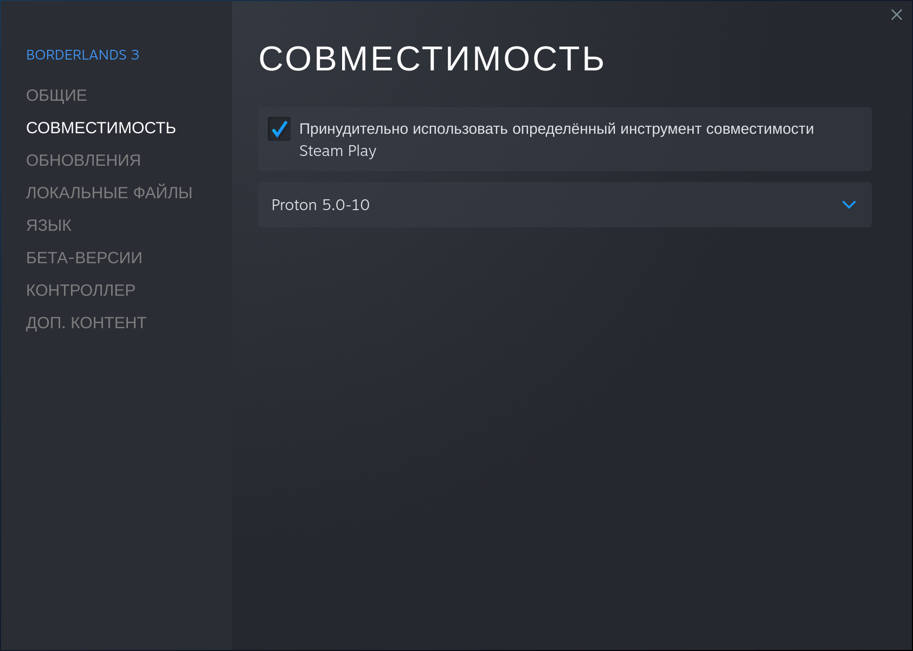

Решил поиграть в третью борду под линуксом. Случайно заметил, что не работает видео-вступление. Вместо него - чёрный экран и тишина, и потом уже через 30 секунд запускается сама игра. Но как-то не придал этому значения.

Прямо во время первой же миссии. После перестрелок с сектантами, босс-файта и появления Лилит (один из главных персонажей всей серии игр), мы идём в комнату с телевизором, на котором она включает какое-то видео. Какое - непонятно, потому что видеофайл просто не отображается на нём. Из-за этого игра софтлочится на моменте просмотра, и Лилит не открывает дверь к следующей локации.


## Причина

Причиной бага является отсутствие в системе Media Foundation. Собственно, его нужно установить, чтобы видео в игре работали.

## Решение

> В статье рассматривается решение для Steam-версии игры.

В свойствах игры в Steam выбираем Proton 5.0-10 в качестве рантайма.



Устанавливаем зависимости:

```shell
sudo dnf install cabextract python2
```

Качаем и запускаем скрипт [`mf-install`](https://github.com/z0z0z/mf-install)
```shell
git clone https://github.com/z0z0z/mf-install
cd mf-install
WINEPREFIX="$HOME/.steam/steam/steamapps/compatdata/397540/pfx" PROTON="$HOME/.steam/steam/steamapps/common/Proton 5.0" ./mf-install.sh -proton
cd ..
```

Теперь нужно скачать Media Foundation с сайта Microsoft и ещё один скрипт [`mf-installcab`](https://github.com/z0z0z/mf-installcab). Но перед этим нужно сделать симлинк для `libudev`, иначе он не сработает.
```shell
sudo mkdir -p /usr/lib/x86_64-linux-gnu
sudo ln -svf /usr/lib/libudev.so.1 /usr/lib/x86_64-linux-gnu/libudev.so.0
```

После этого можно приступать к скачиванию пакета и его установке.
```shell
# Файл весит примерно 900 МБ
wget http://download.windowsupdate.com/msdownload/update/software/svpk/2011/02/windows6.1-kb976932-x64_74865ef2562006e51d7f9333b4a8d45b7a749dab.exe
mv windows6.1-kb976932-x64_74865ef2562006e51d7f9333b4a8d45b7a749dab.exe windows6.1-KB976932-X64.exe
# Если логи скрипта будут кидать предупреждения о том, что не какого-то файла или каталога - просто проигнорируйте
WINEPREFIX="$HOME/.steam/steam/steamapps/compatdata/397540/pfx" PROTON="$HOME/.steam/steam/steamapps/common/Proton 5.0" ./install-mf-64.sh -proton
cp mfplat.dll "$HOME/.steam/steam/steamapps/common/Borderlands 3/OakGame/Binaries/Win64/"
```

После этого запускаем игру и проверим, что всё работает.

Теперь вступительные ролики и внутриигровые видео нормально работают. Можно и поиграть.
